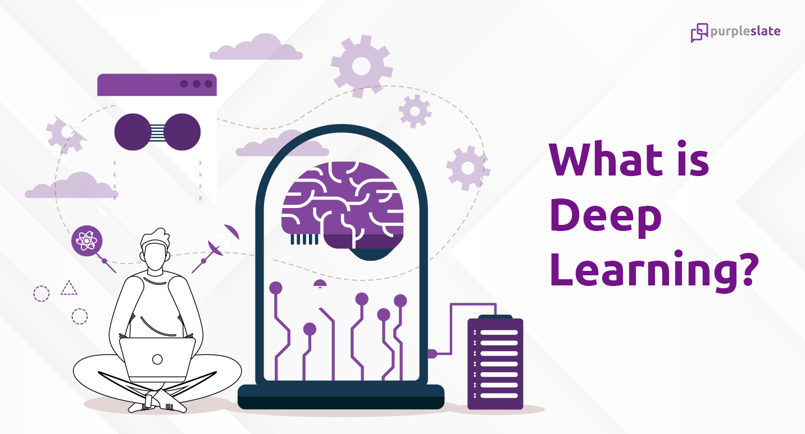

# Deep Learning Training

Deep learning Training is an intensive, immersive training program designed to teach participants the fundamentals and advanced concepts of deep learning, a subset of machine learning. This training is often aimed at individuals who have some prior knowledge of programming and basic machine learning concepts, but it can also cater to beginners with a strong interest in the field.

Deep learning training also covers various model architectures, such as feedforward networks, convolutional neural networks, recurrent neural networks, autoencoders, etc., providing a comprehensive understanding of their design and applications.

**Bassem Ben Hamed**

